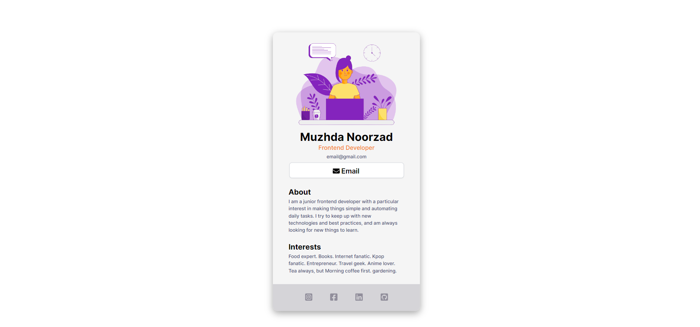
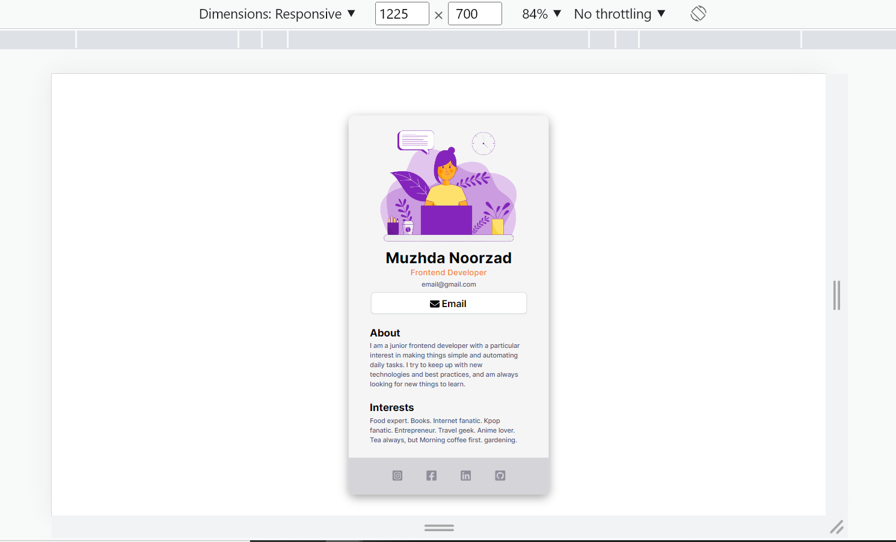
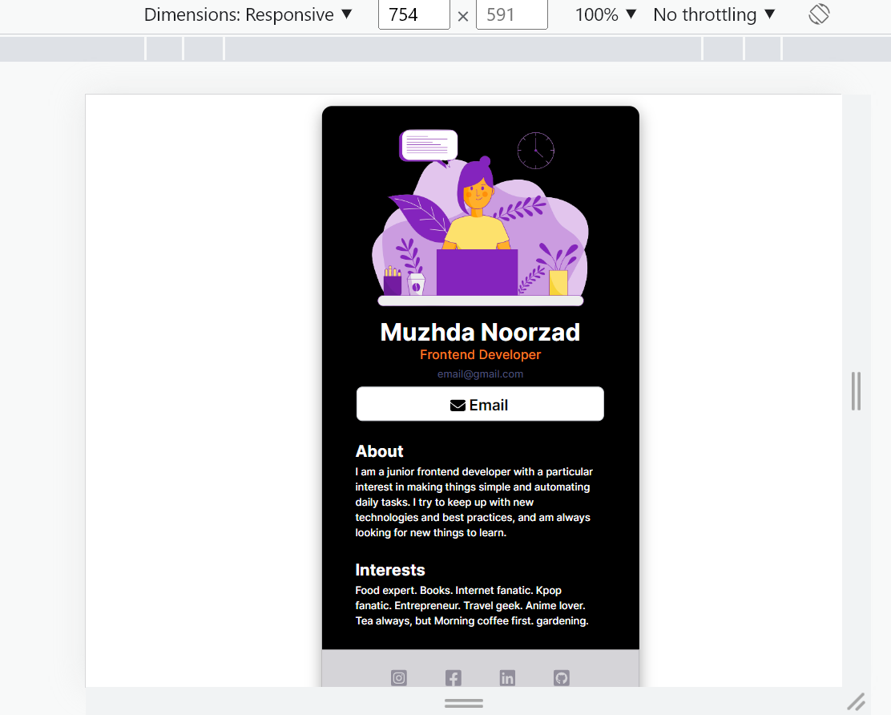
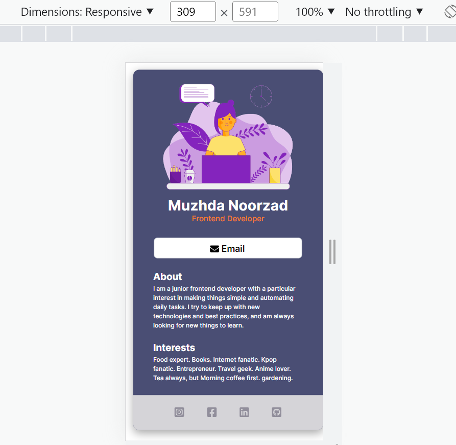

#  **Static Digital Bussiness Card**


- This is a responsive static bussiness card. The design has been taken from the FreeCodeAcadempy [youtube](https://www.youtube.com/watch?v=bMknfKXIFA8) video. 
- The developer has changed the design according to her choice. 
- The email button works in small devices such as mobile. 

#### Check the website [here](https://muzhdan.github.io/business-card/).  


## Design

Check out the following static bussiness card for the responsivness: 


- **StaticBussiness Card in Desktop**


- **Static Bussiness Card in Tablet**


- **Static Bussiness Card in Phone**


## **Fixed Errors**

 - **Error**: ```WebSocketClient.js:16 WebSocket connection to 'wss://3000-...' failed:```
    - **Solution**: create ".env" file and add the following code, then save it. [src](https://github.com/facebook/create-react-app/issues/11897)
    ```
       WDS_SOCKET_PORT=0 
    ```

- **Error**:  
    - `GET https://3000-.../manifest.json 401 (Unauthorized)` 
    - `manifest.json:1 Manifest: Line: 1, column: 1, Syntax error.`

    - **Solution**: Add the fowllwing code in your `index.html` page
    ``` 
            <link rel="manifest" href="manifest.json" crossorigin="use-credentials"> 
    ```

*(Please remmber to restart the webpage after adding the above codes)*
   
